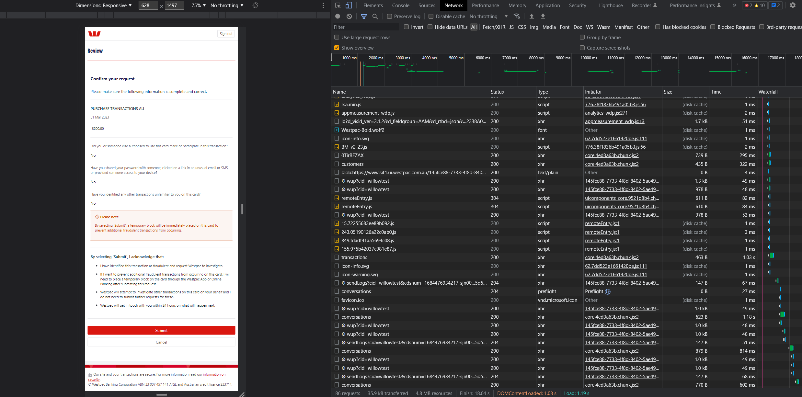
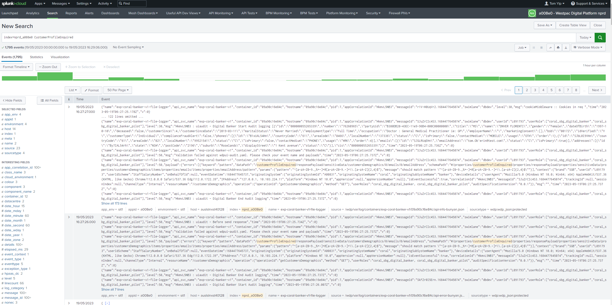
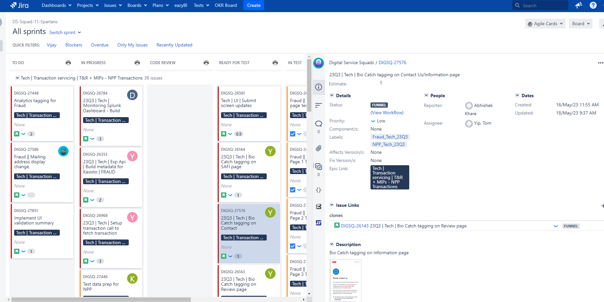

## 1. Enhancing Debugging Skills for Effective Issue Resolution

During my Work-Integrated Learning (WIL) placement, I encountered various challenges related to debugging both frontend and backend applications, as well as resolving failures in written test cases. These tasks necessitated the utilization of a range of debugging skills, including the effective use of browser consoles, network logs for information sharing, Splunk for transaction log analysis, and the debug mode in VS code for troubleshooting test cases. In this critical reflection, I will examine my actions in these areas and explore opportunities for improvement, highlighting the importance of continuous learning and future skill development.

With my prior experience in JavaScript development, I had already acquired foundational debugging skills, such as using console logs to track variable values in the browser. However, the complexity of the Westpac application demanded a higher level of proficiency in debugging to identify and address API transaction issues, as well as effectively communicate relevant information to my team members for discussion and resolution.

Debugging skills are crucial for developers, transcending industry and context boundaries. The usage of diverse debugging tools is instrumental in identifying and resolving issues during the integration of various applications, including UI and backend systems, as well as interactions with third-party software. Looking back, I recognize that if I had possessed stronger debugging skills prior to my placement, I would have been able to perform my tasks more efficiently and expediently. Moreover, effective communication with team members would have been facilitated, leading to smoother collaboration.

Through this critical reflection, I have identified the need to enhance my debugging skills further and make a commitment to continuous learning. In order to continually develop and improve in this area, I have devised a plan for my future career:

1. Stay Updated with Debugging Tools: To keep pace with evolving technologies and practices, I will proactively seek out and familiarize myself with the latest debugging tools. This includes staying informed about browser extensions and VS code plugins that can streamline and enhance the debugging process.

2. Learn Network Analysis Practices: Recognizing the importance of network log analysis, I will dedicate time to studying and adopting professional practices in this field. This will enable me to effectively analyze API transactions and troubleshoot integration issues, ensuring smoother interactions between different components of an application.

## 2. Project Management Skill

During my WIL placement at Westpac, I had the opportunity to delve into project management practices within the context of ITILs (IT Infrastructure Library). This critical reflection will examine my actions and identify areas where different actions could have led to better outcomes. It will also explore the knowledge and skills I have gained through this experience, along with areas for future development and my commitment to continuous learning.

At Westpac, project management was structured around the concept of individual projects, with each feature treated as a separate project. Different teams, organized under various value trains, were responsible for specific projects. The teams had the flexibility to choose between agile and waterfall processes based on project requirements. As a member of a squad in the Digital Service Trains, my role was to deliver the transaction trace service for the Westpac digital platform. The squad consisted of frontend and backend developers, business analysts, project managers, scrum masters, and quality assurance (QA) engineers. Understanding the team structure and the roles played by each member was critical for effective coordination.

While I had experience working as a developer in multiple start-ups, I had limited exposure to ITILs and had never collaborated with such a diverse team. I relied on the ITILs knowledge I acquired during my Master's degree to grasp the organization's structure and daily operations. However, the complexity increased in a real-world setting as each team customized their configurations to adapt to specific project contexts.

Upon reflection, I realized that a deeper understanding of ITILs and project management scope would have enabled me to play a more active role in sprint planning and team discussion meetings. By comprehending the roles and responsibilities of each team member, I could have improved communication and sought appropriate assistance for different tasks. This would have facilitated smoother workflows and enhanced overall team performance.

To address these areas of improvement and further develop my project management skills, I have devised the following plan:

1. Study ITILs: I will enroll in a course to gain a comprehensive understanding of ITILs and acquire a certification. This will provide me with the necessary knowledge to effectively navigate project management within an ITIL framework.

2. Learn from Peers: I will actively seek opportunities to learn from my peers who have expertise in project management. By engaging in discussions and seeking their guidance, I can gain insights and practical tips that will enhance my skills in coordinating and collaborating with multidisciplinary teams.

3. Further Reading: I will explore additional resources, such as books, articles, and case studies, to broaden my knowledge of project management methodologies and best practices. This continuous self-study will ensure that I stay updated with the latest trends and advancements in the field.