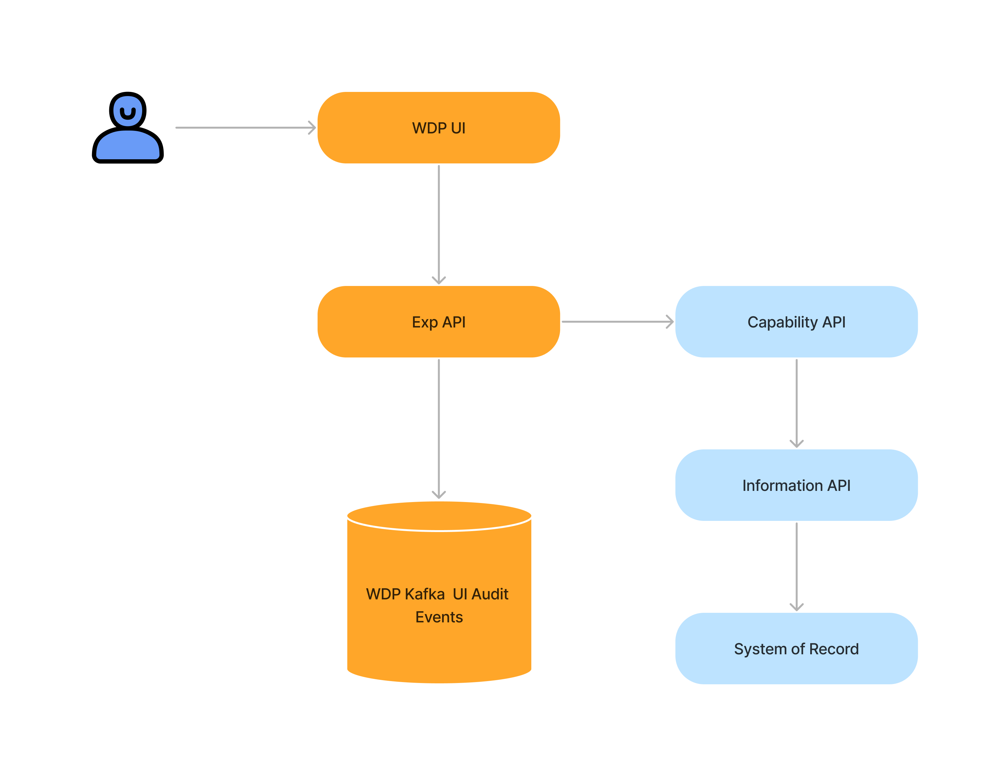

## 1. Coding Practice and Testing

During my software developer placement at Westpac, I had the opportunity to develop and enhance my coding practice skills, specifically focusing on achieving a test coverage rate of over 80% for various UI and function components using the Jest testing framework. Prior to this placement, my experience in JavaScript development had provided me with an understanding of the testing syntax. However, my previous work in small start-ups did not prioritize testing due to limited resources such as a small team size, tight budget, and fast-paced development timelines.

To improve my coding practice skills and meet the testing requirements at Westpac, I took several actions. Firstly, I studied the official documentation of the Jest framework, gaining a deeper understanding of its features and functionalities. I also examined unit test source codes from related projects, allowing me to observe real-world examples and best practices. Additionally, I dedicated time to studying the underlying logics of the components being tested, enabling me to develop more comprehensive and effective tests.

Furthermore, I actively engaged with my teammates, initiating discussions and seeking their insights on testing principles such as function mocks, stubs, spies, and fakes. Their guidance and expertise proved invaluable in expanding my knowledge and improving my testing strategies. As I progressed, I started by writing small-scale tests and gradually advanced to creating fully comprehensive test suites.

Through this experience, I not only enhanced my coding practice skills but also acquired valuable insights. I learned the significance of unit tests and how they contribute to the overall quality and reliability of software. Moreover, I gained a deeper understanding of the distinctions between unit tests, integration tests, and user acceptance tests, each serving unique purposes in the software development lifecycle. Furthermore, I expanded my knowledge by familiarizing myself with the Jest testing syntax, enabling me to effectively write and execute tests for the different UI and function components.

This placement provided an opportunity to apply my existing skills and knowledge to a new context. Although I had a foundational understanding of testing syntax from my previous JavaScript development experience, the context at Westpac, with its emphasis on achieving high test coverage rates and the utilization of the Jest framework, was distinct. Through this project, I deepened my understanding of testing principles and gained practical experience in applying them to a large-scale codebase.

This experience not only enhanced my technical abilities but also fostered a deeper appreciation for the importance of testing in software development. Moving forward, I am committed to continuous learning and will seek further opportunities to refine my skills and expand my knowledge in this area.

## 2. System Architecture

During my placement at Westpac, I had the opportunity to delve into the complexity of their system architecture, which exposed me to a vast code base and various build pipelines and CI/CD processes. The architecture encompassed frontend UI, backend facilities such as the Experience API, Capability API, Information API, as well as external services like Kafka streaming service and Biocatch. While my previous experience with AWS and Alicloud for software hosting provided a foundation, I quickly realized that Westpac's architecture was on a much larger scale, requiring additional layers to ensure system stability.

To gain a comprehensive understanding of the architecture implementation at Westpac, I took several actions. Firstly, I studied the process documentation provided internally, which provided insights into the overall structure and workflow. Additionally, I cloned a sample project and conducted the build and deploy phase manually. This hands-on approach allowed me to test and comprehend the intricacies of the process.

Recognizing the value of collaboration and learning from experienced developers, I engaged in discussions with senior team members. These conversations provided further clarity and allowed me to gain practical insights into the architecture. I also referred to the official documentation of the corresponding software, leveraging the resources available to deepen my understanding.
To solidify my comprehension and apply the knowledge gained, I undertook additional research into the implementation of similar architectures. This involved exploring case studies and analyzing real-world examples. Furthermore, I embarked on a personal project where I aimed to build a similar architecture. This practical exercise allowed me to further solidify my understanding and apply the concepts in a different context.

Through these actions, I not only gained a comprehensive understanding of the architecture implementation at Westpac but also extended my skills and knowledge in system architecture. I developed a deeper appreciation for the importance and necessity of well-designed architecture and the critical role it plays in maintaining system stability.

This experience allowed me to leverage my existing skill set in system architecture and apply it to a different context, characterized by the larger scale and complexity of Westpac's system. By actively engaging in learning activities, seeking guidance from senior developers, and undertaking practical projects, I was able to deepen my understanding and enhance my capabilities in system architecture.